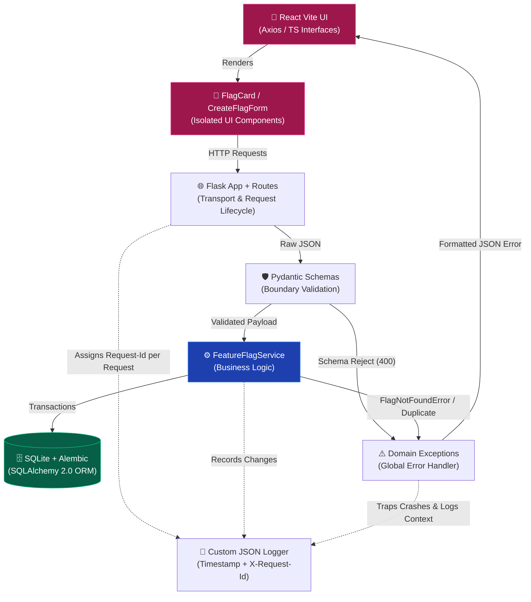

# SafeSwitch - Senior SE Assessment

A highly resilient, schema-driven Feature Toggle API built targeting structure, simplicity, and interface safety above all else.

## Architecture Overview




## Key Technical Decisions

1. **Python 3.9 for Zero-Setup Evaluation**
   `pydantic-core` lacks ARM macOS pre-compiled wheels for Python 3.12+, which would force the reviewer to install a Rust toolchain from scratch. Python 3.9 stable is used to guarantee a `pip install` that just works.

2. **Domain-Driven Exception Handling**
   Instead of scattering `try/except` inside HTTP routes, all domain errors inherit from `DomainError` in `backend/exceptions.py`. A single global error handler in `app.py` maps every class of failure — Pydantic validation, domain rules, HTTP exceptions, and unhandled crashes — to consistent JSON responses (`400/404/409/415/500`). No route touches error formatting.

3. **Schema-First Interface Safety (Pydantic 2.x)**
   All write boundaries are enforced by Pydantic before any business logic runs. The `name` field carries both length constraints and a strict regex pattern (`^[a-z0-9_-]+$`) — rejecting whitespace-only strings, uppercase letters, and special characters at the schema layer, not the service layer. Responses are serialized through `FeatureFlagResponse` (not the ORM's `to_dict`), keeping input and output schemas independently versioned.

4. **Alembic for Safe Schema Evolution**
   `db.create_all()` is kept for test bootstrapping but is not the migration strategy. Alembic is wired to `backend.models.Base.metadata` for autogenerate support — any model change generates a versioned, reviewable migration file. The initial schema is committed as `migrations/versions/`.

5. **Structured, Traceable Logging**
   Every log line is emitted as JSON with `timestamp`, `level`, `message`, `logger`, and `request_id`. The `request_id` is pulled from the `X-Request-Id` header if provided, or generated via `uuid4()` per request. This makes every log line correlatable across distributed systems or API gateways without any post-processing.

6. **Isolated UI Components**
   The React frontend separates state management (`App.tsx`) from rendering (`FlagCard`, `CreateFlagForm`). Each component owns only what it needs — `CreateFlagForm` manages its own form state locally; `App.tsx` owns only flags list, loading, and error state. This mirrors the backend's separation of transport from logic.

## Known Limitations & Future Architecture

A senior architecture understands its limits. As SafeSwitch scales:

- **Persistence:** SQLite cannot handle concurrent writes at scale. The next step is Postgres with a connection pool (e.g., `pg8000` + `SQLAlchemy`). The Alembic setup makes this a config-only change.
- **Caching:** Feature flags are read-heavy. Adding Redis in front of `FeatureFlagService.get_all_flags()` would drastically reduce DB load with a simple TTL invalidation strategy.
- **Multi-tenancy:** SafeSwitch is globally scoped. The next schema evolution adds `environment_id: str` to `FeatureFlag`, mapping flags to `{production, staging, uat}` namespaces. Alembic makes this a single `alembic revision --autogenerate` away.
- **Authentication:** The API is currently open. Production use requires flag-scoped API keys or OAuth2 token validation at the route layer.

## How to Run Locally

### 1. Start the Backend API
```bash
python3 -m venv backend/venv
source backend/venv/bin/activate
pip install -r backend/requirements.txt
flask --app backend.app:create_app run --port 8000
```

### 2. Start the Frontend Dashboard
```bash
# In a separate terminal, inside the frontend/ folder:
npm install
npm run dev
```

Visit `http://localhost:5173` to use the dashboard.

### 3. Run Database Migrations (Alembic)
```bash
# Apply all pending migrations (run from project root with venv active):
alembic upgrade head

# After any change to backend/models.py:
alembic revision --autogenerate -m "describe_your_change"
alembic upgrade head

# Verify the database is at the latest revision:
alembic check
```

### 4. Run the Test Suites
```bash
# Backend (from project root, venv active):
python -m pytest backend/tests -v

# Frontend (from frontend/ folder):
npm run lint
npm run test
npm run build
```
