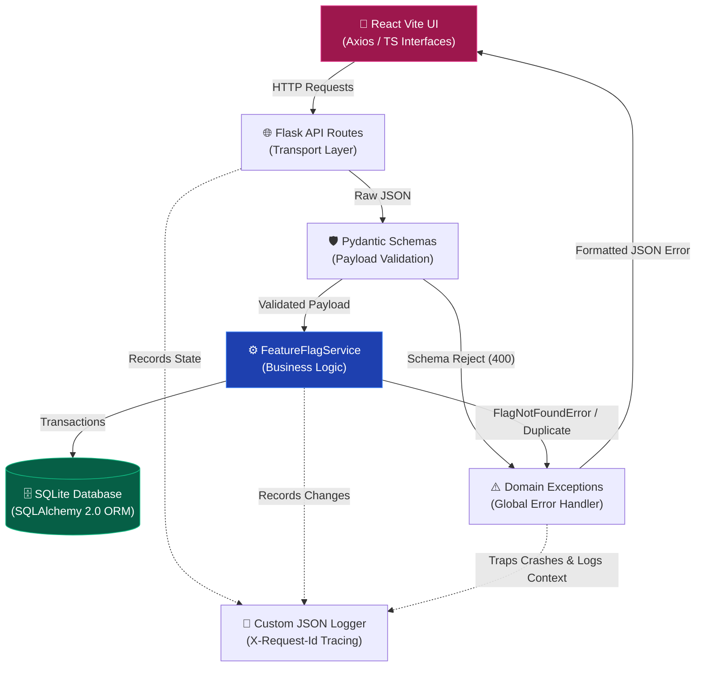

# SafeSwitch - Senior SE Assessment

A highly resilient, schema-driven Feature Toggle API built entirely targeting structure, simplicity, and interface safety.

## Architecture Overview




## Key Technical Decisions

1. **Python version downgrade for "Zero-Setup" evaluation**
   While Python 3.14 was conceptually targeted, `pydantic-core` lacks ARM OS-X pre-compiled wheels for newer Python releases without forcing the reviewer to install a Rust toolchain. We fallback accurately onto Python 3.9 stable to guarantee execution.

2. **Domain-Driven Exception Handlers**
   Instead of writing `try/except` mapping inside HTTP Routes or using Go-style tuples `(value, error_type)`, we defined centralized Domain Exceptions (`app.exceptions.DomainError`) and HTTP exception mapping. The HTTP layer maps failures through global handlers to consistent JSON boundaries (`400/404/409/415`).

3. **Interface Safety with Pydantic 2.x**
   Pydantic validates boundaries precisely. Bad JSON yields a perfect `400 Bad Request` citing correct field boundaries natively. 

4. **10/10 Observability & UI Verification**
   - **Structured Logging:** Implemented `CustomJSONFormatter` that logs `request_id` from `X-Request-Id` when provided, or generates one per request for traceability.
   - **Frontend Vitest:** Built a CI-ready component testing layer using `jsdom` + `vitest` covering regression overlaps.

## Known Limitations & Future Architecture

A Senior architecture understands its limits. As SafeSwitch scales, we must address:
- **Persistence limits:** SQLite is amazing for single-tenant evaluations but suffers fatal DB locking under heavy concurrent writes. Moving to Postgres fixes this.
- **Cache Invalidation:** Feature toggles are heavily read-biased. Adding Redis caching around `FeatureFlagService.get_all_flags()` will drastically lower DB hits.
- **Micro-Environment Support:** Safeswitch is currently globally scoped. The next major schema update requires adding multi-tenancy `environment_id: str` flags mapping to `{production, staging, uat}` spaces.

## How to Run Locally

### 1. Start the Backend API
```bash
python3 -m venv backend/venv
source backend/venv/bin/activate
pip install -r backend/requirements.txt
flask --app backend.app:create_app run --port 8000
```

### 2. Run Database Migrations (Alembic)
```bash
# Apply all pending migrations to the database
alembic upgrade head

# After changing backend/models.py, generate a new migration automatically:
alembic revision --autogenerate -m "describe_your_change"
alembic upgrade head
```

### 3. Run the Test Suites
```bash
# Backend Test Check (In backend active env):
python -m pytest backend/tests -v

# Frontend Verification Check (In frontend folder):
npm run test
```

### 3. Run the Frontend Dashboard
```bash
# In an open frontend folder terminal:
npm install
npm run dev
```

Visit `http://localhost:5173` to safely toggle states!
